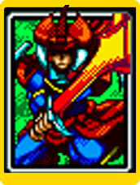
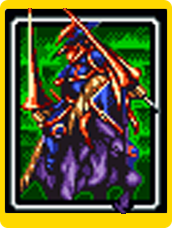
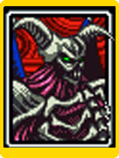

# Yu-Gi-Oh | Jo-ken-po Edition

Um mini-game inspirado no clássico Jo-Ken-Po, mas com cartas e personagens do universo Yu-Gi-Oh!. O objetivo do desafio foi recriar a mecânica de pedra, papel e tesoura utilizando JavaScript puro, manipulação de DOM e lógica própria de vitória e derrota, tudo com uma interface temática interativa.

## 📸 Prévia

### Cartas Disponíveis :

## 🚀 Funcionalidades

- 🎴 Escolha de cartas interativas com hover mostrando detalhes
- 🤖 IA simples que seleciona uma carta aleatória para duelar
- ⚔️ Sistema de batalha baseado nas regras do Jo-Ken-Po
- 📊 Placar dinâmico com vitórias e derrotas
- 🔊 Efeitos sonoros para vitória, derrota e empate
- 🔄 Gerador automático de cartas para próximas rodadas
- 🎨 Layout temático de Yu-Gi-Oh com imagens, ícones e animações
- 📱 Responsividade para telas menores

## 🛠️ Tecnologias Utilizadas

- HTML5
- CSS3
- JavaScript

## 🎯 Conceitos Abordados

- Manipulação da DOM
- Gerenciamento de estado manual
- Modularização de funções
- Organização e separação de responsabilidade
- Lógica de comparação entre objetos
- Uso de addEventListener para eventos dinâmicos
- Arrays e objetos para modelagem de dados
- Estruturação de pastas e assets

## 📦 Rodar o Projeto
https://victorrf.github.io/yugioh-js-game/

## 🤝 Créditos

- Assets e estrutura base do projeto 👉 https://github.com/digitalinnovationone/js-yugioh-assets

- Aulas do professor Felipe Aguiar (DIO) 👉 https://github.com/felipeAguiarCode/

Este projeto como parte de um projeto educacional da **Digital Innovation One**.